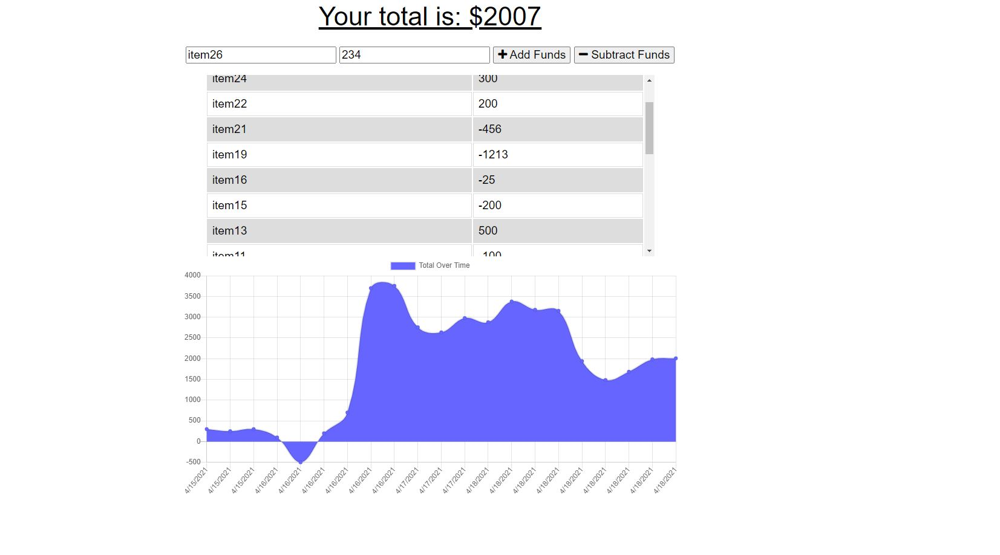

# Budget Tracker
  
  ### Github: https://github.com/cruzma/budget-tracker/
  ### Website: https://thawing-mesa-66730.herokuapp.com/ 

  ## Table of Contents
  - [Description](#description)
  - [User Story](#User&#32Story)
  - [Acceptance Criteria](#Acceptance&#32Criteria)
  - [Installation](#installation)
  - [Image Demo](Image#32Demo)
  - [Usage](#usage)
  - [Test](#test)

  - [Questions](#questions)

  ## Description
  A budget tracker that keeps track of all your expenses that are logged with or without internet connection, Should display the total transaction even if entered online or offline<br/>
  <br/>
  <br/>
  ## User Story
  ```
  AS AN avid traveler
  I WANT to be able to track my withdrawals and deposits with or without a data/internet connection
  SO THAT my account balance is accurate when I am traveling 
  ```
  ## Acceptance Criteria
  ```
  GIVEN a budget tracker without an internet connection
  WHEN the user inputs an expense or deposit
  THEN they will receive a notification that they have added an expense or deposit
  WHEN the user reestablishes an internet connection
  THEN the deposits or expenses added while they were offline are added to their transaction history and their totals are updated
  ```
  ## Installation
  Please install express and mongoose.

  ## Image Demo
  
  

  ## Usage

  please type npm start in terminal to start

  ## Test
  Please type npm start in terminal after all dependicies have been installed.

  ## Questions
  [@cruzma](https://github.com/cruzma)</br>
